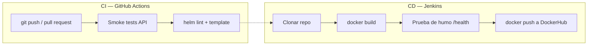

# Core Banking Lite — Laboratorio CI/CD

Microservicio bancario con pipelines de **CI (GitHub Actions)** y **CD (Jenkins → DockerHub)**, desplegable con **Docker → Helm → Kubernetes → ArgoCD**.

Simula un banco (clientes, cuentas, transacciones en COP). **Stateless**: datos en memoria, pensado para CI/CD, rolling update y varias replicas sin pelear por discos.

**Integrantes:**
- Fabián Andrés Rojas García
- Jorge Eliécer Rojas Quiñones
- Juan Esteban Gómez Roa

**Curso:** Flujos de entrega eficientes: CI/CD y automatización — Universidad de La Sabana

---

## Qué es esto

Backend bancario con API REST y Swagger. El proyecto implementa **dos pipelines** que
cubren el ciclo CI/CD de la entrega:

- **CI — GitHub Actions** (`.github/workflows/ci.yml`): valida el código en cada push
  y pull request (pruebas de la API + validación del chart de Helm).
- **CD — Jenkins** (`Jenkinsfile`): construye la imagen Docker del backend y la publica
  en **DockerHub**.

Como complemento, el repositorio conserva la infraestructura de despliegue en
**Kubernetes con Helm y ArgoCD** del proyecto base, documentada más abajo.

---

## Pipeline de la entrega: CI (GitHub Actions) + CD (Jenkins)



### CI — GitHub Actions (`.github/workflows/ci.yml`)

| Etapa | Qué hace |
|-------|----------|
| **Checkout** | Descarga el código de la rama |
| **Setup Python** | Configura Python 3.11 e instala dependencias |
| **Smoke tests** | Valida `/health`, datos seed y una transferencia de prueba |
| **Validar Helm** | `helm lint` + `helm template` sobre el chart |

Dispara en **push a `main`** y en **pull request** hacia `main`.

### CD — Jenkins (`Jenkinsfile`)

| Stage | Qué hace |
| --- | --- |
| **Clonar repositorio** | Clona `main` y captura el SHA corto del commit |
| **Construir imagen Docker** | `docker build` con tags: `build-N`, SHA y `latest` |
| **Prueba de humo** | Levanta el contenedor y consulta `/health` antes de publicar |
| **Publicar en DockerHub** | `docker login` + `docker push` de las tres etiquetas |

**Requisitos en Jenkins:**
- Credencial tipo *Username with password* con ID `dockerhub-credentials`
  (usuario de DockerHub + un Access Token, no la contraseña).
- Docker disponible en el agente.
- Ajustar `DOCKERHUB_USER` en el `Jenkinsfile` si tu usuario difiere.

---

## Infraestructura complementaria: Kubernetes + ArgoCD

Además de los dos pipelines de la entrega, el repositorio incluye la infraestructura
de despliegue en Kubernetes del proyecto base: un chart de **Helm** y una definición de
**ArgoCD** que despliega el servicio con rolling update y 2 réplicas. Esta parte se
documenta en las secciones de Kubernetes y ArgoCD más abajo.

---

## Arquitectura hexagonal

```
app/
├── domain/              Entidades, enums, excepciones, ports
├── application/         Casos de uso
├── infrastructure/
│   ├── persistence/     Repositorios en memoria
│   ├── seed/            Datos de ejemplo al arrancar cada pod
│   └── web/             FastAPI (routers, schemas)
└── main.py
```

**Flujo:** Router → Caso de uso → Repositorio en memoria

---

## Modulos de la API

Swagger en `/docs`.

### Clientes — `/api/v1/clientes`

| Metodo | Ruta | Descripcion |
|--------|------|-------------|
| POST | `/clientes` | Crear cliente |
| GET | `/clientes` | Listar (paginado) |
| GET | `/clientes/{id}` | Detalle |
| PATCH | `/clientes/{id}` | Actualizar nombre/email |

### Cuentas — `/api/v1/cuentas`

| Metodo | Ruta | Descripcion |
|--------|------|-------------|
| POST | `/cuentas` | Abrir cuenta (ahorros o corriente) |
| GET | `/cuentas` | Listar (filtro por `cliente_id`) |
| GET | `/cuentas/{id}` | Detalle + saldo |
| PATCH | `/cuentas/{id}/estado` | Activar / bloquear / cerrar |

### Transacciones — `/api/v1/transacciones`

| Metodo | Ruta | Descripcion |
|--------|------|-------------|
| POST | `/transacciones/consignacion` | Ingresar dinero |
| POST | `/transacciones/retiro` | Retirar (valida saldo) |
| POST | `/transacciones/transferencia` | Entre dos cuentas |
| GET | `/transacciones` | Historial (filtros) |
| GET | `/transacciones/{id}` | Detalle |

### Sistema

| Metodo | Ruta | Descripcion |
|--------|------|-------------|
| GET | `/` | Info del servicio |
| GET | `/health` | Health check (K8S probes) |
| GET | `/info` | Runtime del pod |
| GET | `/docs` | Swagger UI |

IDs seed: `seed-cliente-001`, `seed-cliente-002`, `seed-cuenta-001`, `seed-cuenta-002`, `seed-cuenta-003`

---

## Stateless (sin JSON ni PVC)

- Cada pod tiene su **propia memoria** con datos seed al arrancar
- Al hacer deploy los datos **no persisten** (como muchos servicios stateless de verdad)
- Ventaja: **2 replicas**, rolling update `maxSurge: 1` / `maxUnavailable: 0` → casi sin corte
- En un banco real el siguiente paso seria PostgreSQL; aqui priorizamos el flujo DevOps

---

## Estructura del repo

```
laboratorio-devops/
├── app/
├── Dockerfile
├── Jenkinsfile
├── helm/mi-microservicio/
│   ├── values.yaml
│   └── templates/
│       ├── deployment.yaml
│       ├── service.yaml
│       └── ingress.yaml
├── argocd/application.yaml
└── .github/workflows/ci.yml
```

---

## Probar en local

```powershell
cd app
python -m venv .venv
.venv\Scripts\activate
pip install -r ..\requirements.txt
uvicorn main:app --reload --port 8000
```

`http://localhost:8000/docs`

---

## Kubernetes con Minikube

### 1. Cluster + Ingress

```powershell
minikube start
minikube addons enable ingress
```

### 2. Helm

```powershell
helm upgrade --install mi-microservicio ./helm/mi-microservicio `
  --namespace mi-microservicio --create-namespace
```

Verificar 2 replicas:

```powershell
kubectl get pods -n mi-microservicio
```

### 3. Hosts

`minikube ip` → agregar en `C:\Windows\System32\drivers\etc\hosts`:

```
<IP>  banking.local
```

### 4. Swagger

**http://banking.local/docs**

Tras un deploy de ArgoCD solo recarga el navegador. El Ingress no se cae como el port-forward.

---

## ArgoCD

```powershell
kubectl apply -f ./argocd/application.yaml
```

Estado esperado: **Synced** + **Healthy**

---

## Version de la app

| Donde | Para que |
|-------|----------|
| `values.yaml` → `env.APP_VERSION` | Swagger + `/info` en el cluster |
| `helm/.../Chart.yaml` → `appVersion` | Metadata del chart |
| `image.tag` en `values.yaml` | Lo usa el despliegue en Kubernetes (flujo ArgoCD complementario) |

---

## Comandos utiles

```powershell
kubectl get pods,ingress -n mi-microservicio
kubectl logs -n mi-microservicio -l app.kubernetes.io/name=mi-microservicio --tail=50
helm upgrade mi-microservicio ./helm/mi-microservicio --namespace mi-microservicio
curl http://banking.local/health
```

---

## Errores comunes

| Codigo | Significado |
|--------|-------------|
| 404 | Recurso no existe |
| 409 | Documento duplicado o idempotency key repetida |
| 422 | Saldo insuficiente |
| 400 | Cuenta bloqueada/cerrada |

Si el CI falla en los **tests**, revisa la pestaña Actions en GitHub. El CD en Jenkins
solo debe ejecutarse sobre código que ya pasó la validación del CI.
